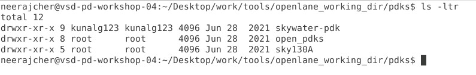
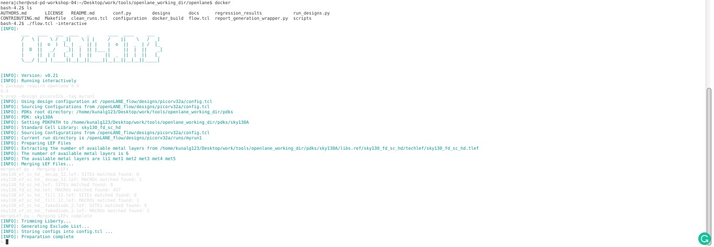
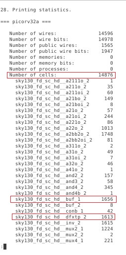

# Physical-Design-With-OpenLANE-and-SKY130
This repository contains all the information studied and created during the [Advanced Physical Design Using OpenLANE / SKY130](https://www.vlsisystemdesign.com/advanced-physical-design-using-openlane-sky130/) workshop. It is primarily foucused on a complete RTL2GDSII flow using the open-soucre flow named OpenLANE. [PICORV32A](https://github.com/cliffordwolf/picorv32) RISC-V core design is used for the purpose as the RTL design source.

# Table of Contents

- [Introduction To RTL to GDSII Flow](#introduction-to-rtl-to-gdsii-flow)
- [About Google SkyWater PDK](#about-google-skywater-pdk)
- [List of All Open-Source Tools Used](#list-of-all-open-source-tools-used)
- [Setting Up Environment](#setting-up-environment)
- [Day 1 - Inception of open-source EDA, OpenLANE and Sky130 PDK](#day-1---inception-of-open-source-eda-openlane-and-sky130-pdk)
  - [Basic IC Design Terminologies](#basic-ic-design-terminologies)
  - [Introduction To RISC-V](#introduction-to-risc-v)
  - [SoC Design and OpenLANE](#soc-design-and-openlane)
    - [Open-Source PDK Directory Structure](#open-source-pdk-directory-structure)
    - [What is OpenLANE](#what-is-openlane)
  - [Open-Source EDA Tools](#open-source-eda-tools)
    - [OpenLANE Initialization](#openlane-initialization)
    - [Design Preparation](#design-preparation)
    - [Design Synthesis and Results](#design-synthesis-and-results)

# Introduction To RTL to GDSII Flow

RTL to GDSII flow refers to the all the steps involved in converting a logical Register Transfer Level(RTL) Design to a fabrication ready GDSII format. GDSII is a database file format which is an industry standard for data exchange of IC layout artwork.
The RTL to GSDII flow consists of following steps:

- RTL Synthesis
- Static Timing Analysis(STA)
- Design for Testability(DFT)
- Floorplanning
- Placement
- Clock Tree Synthesis(CTS)
- Routing (Global and Detailed)
- GDSII Streaming

All the steps are further discussed in detail in the repository.

# About Google SkyWater PDK

Google and SkyWater Technology Foundry in collaboration have released a completely open-source Process Design Kit(PDK) in May, 2020. The current release targeted to a SKY130 (i.e. 130 nm) process node is available as [SkyWater Open Source PDK](https://github.com/google/skywater-pdk). The PDK provides a VLSI Physical Designer with a wide range of flexibility in design choices. All the designs and simulations listed in this repository are carried out using the same SkyWater Open Source PDK.

# List of All Open-Source Tools Used

| Name of Tool                                                       | Application / Usage                                         |
| ------------------------------------------------------------------ | ----------------------------------------------------------- |
| [Yosys](https://github.com/YosysHQ/yosys)                          | Synthesis of RTL Design                                     |
| ABC                                                                | Mapping of Netlist                                          |
| [OpenSTA](https://github.com/The-OpenROAD-Project/OpenSTA)         | Static Timing Analysis                                      |
| [OpenROAD](https://github.com/The-OpenROAD-Project/OpenROAD)       | Floorplanning, Placement, CTS, Optimization, Global Routing |
| [TritonRoute](https://github.com/The-OpenROAD-Project/TritonRoute) | Detailed Routing                                            |
| [Magic VLSI](http://opencircuitdesign.com/magic/)                  | Layout Tool                                                 |
| [NGSPICE](https://github.com/imr/ngspice)                          | SPICE Extraction and Simulation                             |
| SPEF_EXTRACTOR                                                     | Generation of SPEF file from DEF file                       |

# Setting Up Environment

The above list of tools shows that many different tools are required for various tasks in Physical Design. Each tool in itself has number of system requirements and require various supporting tools to be installed. Installing each tool one-by-one seems in-efficient. This is made easy by some custom scripts that setup the required tools and environment for them in just a few easy steps. To install all the required tools, one can refer to the below mentioned repositories:

- [VSDFlow](https://github.com/kunalg123/vsdflow) - Installs Yosys, Magic, OpenTimer, OpenSTA and some other supporting tools
- [OpenLANE Build Scripts](https://github.com/nickson-jose/openlane_build_script) - Install all required OpenROAD and some supporting tools

# Day 1 - Inception of open-source EDA, OpenLANE and Sky130 PDK

## How to talk to Computers

### Basic IC Design Terminologies

During the Physical Designing, one will come across multiple terminologies that are frequently used. Some of them are mentioned below:

- Package: It is a case that surrounds the circuit material to protect it from physical damage or corrosion and allows for mounting of the electrical contacts connecting it to the printed circuit board (PCB). The below image shows an IC with 48 pins and Quad Flat No-Leads(QFN) package.
- Die: A die is a small block of semiconductor material on which a given functional circuit is fabricated.
- Core: It is the actual area of the IC where the logic resides.
- Pads: These are the interfaces between the internal signals of a chip and the external pins. Wire bonds run between the pads and the external pins.

  

### Introduction To RISC-V

RISC-V is a new ISA that's available under open, free and non-restrictive licences. RISC-V ISA delivers a new level of free, extensible software and hardware freedom on CPU architecture.

- It is far simpler and smaller than other commercial ISAs available.
- It avoids micro-architecture or technology dependent features.
- It has small standard base ISA and multiple standard extensions.
- It supports variable-length instruction encoding.

### From Software to Applications

Application software like Microsoft word can run on the hardware with the Instruction Set as the main interface. To understand more about this, the below image shows the transition from Application software -> Compiler -> Assembler -> Instructions in binary as specified by the ISA -> Executed on an RTL -> RTL to Chip Layout process is the Physical Design.

## SoC Design and OpenLANE

### Open-Source PDK Directory Structure

All the Process Design Kits (PDK) are listed under the `pdks/` directory. Along with the `Sky130A` which we are using, some other open-source PDKs and other related files are also available in the directory. The location of the PDK directory is given of `$PDK_ROOT` variable.

   
  
 ### What is OpenLANE
   [OpenLANE](https://github.com/efabless/openlane) is an automated RTL to GDSII flow which includes various open-source components such as OpenROAD, Yosys, Magic, Fault, Netgen, SPEF-Extractor. It also facilitates to add custom design exploration and optimization scripts.
   The detailed diagram of the OpenLANE architecture is shown below:
   
   
   
   OpenLANE flow consists of several stages. By default all flow steps are run in sequence. Each stage may consist of multiple sub-stages. OpenLANE can also be run interactively as shown here.

1. Synthesis
   1. `yosys` - Performs RTL synthesis
   2. `abc` - Performs technology mapping
   3. `OpenSTA` - Pefroms static timing analysis on the resulting netlist to generate timing reports
2. Floorplan and PDN
   1. `init_fp` - Defines the core area for the macro as well as the rows (used for placement) and the tracks (used for routing)
   2. `ioplacer` - Places the macro input and output ports
   3. `pdn` - Generates the power distribution network
   4. `tapcell` - Inserts welltap and decap cells in the floorplan
3. Placement
   1. `RePLace` - Performs global placement
   2. `Resizer` - Performs optional optimizations on the design
   3. `OpenPhySyn` - Performs timing optimizations on the design
   4. `OpenDP` - Perfroms detailed placement to legalize the globally placed components
4. CTS
   1. `TritonCTS` - Synthesizes the clock distribution network (the clock tree)
5. Routing \*
   1. `FastRoute` - Performs global routing to generate a guide file for the detailed router
   2. `TritonRoute` - Performs detailed routing
   3. `SPEF-Extractor` - Performs SPEF extraction
6. GDSII Generation
   1. `Magic` - Streams out the final GDSII layout file from the routed def
7. Checks
   1. `Magic` - Performs DRC Checks & Antenna Checks
   2. `Netgen` - Performs LVS Checks

## Open-Source EDA Tools

### OpenLANE Initialization

For invoking OpenLANE in Linux Ubuntu, we should first run the docker everytime we use OpenLANE. This is done by using the following script:

    docker run -it -v $(pwd):/openLANE_flow -v $PDK_ROOT:$PDK_ROOT -e PDK_ROOT=$PDK_ROOT -u $(id -u $USER):$(id -g $USER) openlane:rc2

A custom shell script or commands can be generated to make the task simpler.

- To invoke OpenLANE run the `./flow.tcl` script.
- OpenLANE supports two modes of operation: interactive and autonomous.
- To use interactive mode use `-interactive` flag with `./flow.tcl`

   

### Design Preparation

The first step after invoking OpenLANE is to import the openlane package of required version. This is done using following command. Here 0.9 is the required version of OpenLANE.

    package require openlane 0.9

The next step is to prepare our design for the OpenLANE flow. This is done using following command:

    prep -design <design-name>

Some additional flags that can be used while preparation are:
 `-tag <name-for-current-run>` - All the files generated during the flow will be stored in a directory named `<name-for-current-run>`
 `-overwrite` - If a directory name mentioned in `-tag` already exists, it will be overwritten.

    
   
   During the design preparation the technology LEF and cell LEF files are merged together to obtain a `merged.lef` file. The LEF file contains information like the layer information, set of design rules, information about each standard cell which is required for place and route. 
    
 ### Design Synthesis and Results
   The first step in OpenLANE flow is RTL Synthesis of the design loaded. This is done using the following command.
   
    run_synthesis
   
   

**DAY-1 LAB TASK: From the highlighted numbers in the above image, the flop ratio of the synthesized design is 0.1084 and the buffer ratio is 0.111.**
