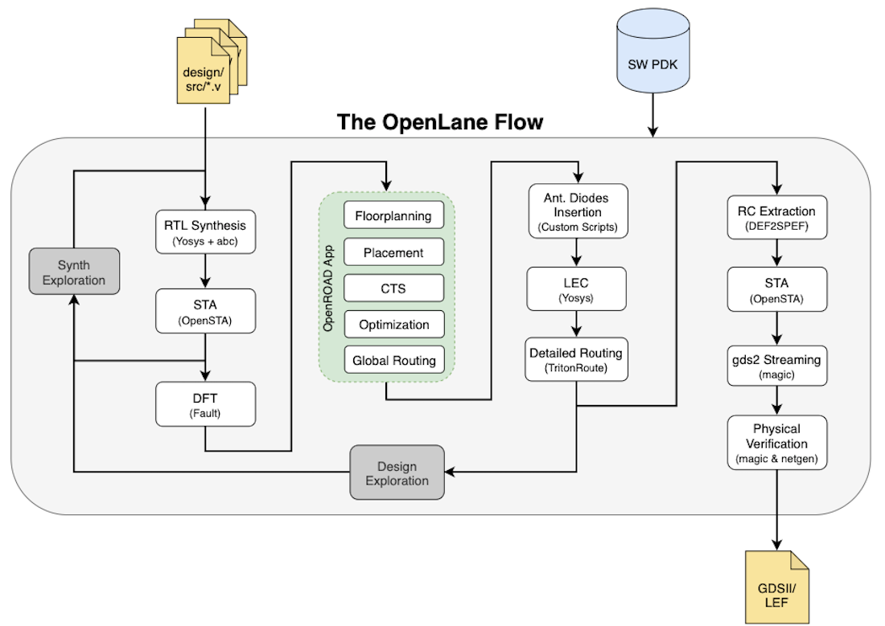
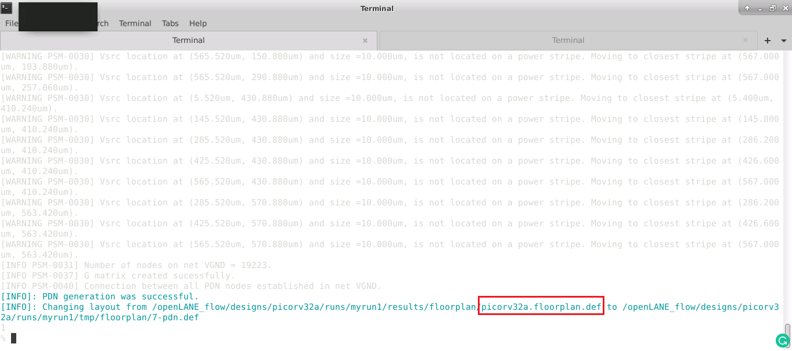
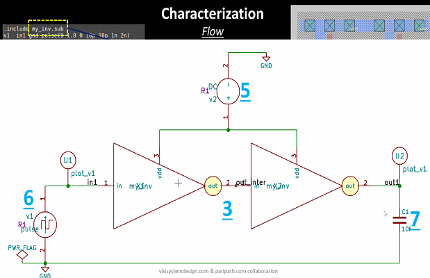
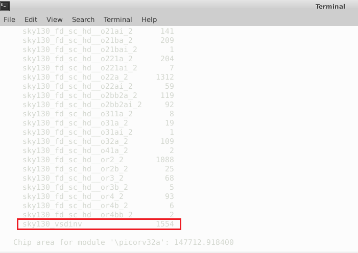

# OpenSource Physical Design

This repository contains all the information studied and created during the [Advanced Physical Design Using OpenLANE / SKY130](https://www.vlsisystemdesign.com/advanced-physical-design-using-openlane-sky130/) workshop. It is primarily foucused on a complete RTL2GDSII flow using the open-soucre flow named OpenLANE. [PICORV32A](https://github.com/cliffordwolf/picorv32) RISC-V core design is used for the purpose as the RTL design source.

# Table of Contents

- [Introduction To RTL to GDSII Flow](#introduction-to-rtl-to-gdsii-flow)
- [About Google SkyWater PDK](#about-google-skywater-pdk)
- [List of All Open-Source Tools Used](#list-of-all-open-source-tools-used)
- [Setting Up Environment](#setting-up-environment)
- [Day 1 - Inception of open-source EDA, OpenLANE and Sky130 PDK](#day-1---inception-of-open-source-eda-openlane-and-sky130-pdk)
  - [Basic IC Design Terminologies](#basic-ic-design-terminologies)
  - [Introduction To RISC-V](#introduction-to-risc-v)
  - [SoC Design and OpenLANE](#soc-design-and-openlane)
    - [Open-Source PDK Directory Structure](#open-source-pdk-directory-structure)
    - [What is OpenLANE](#what-is-openlane)
  - [Open-Source EDA Tools](#open-source-eda-tools)
    - [OpenLANE Initialization](#openlane-initialization)
    - [Design Preparation](#design-preparation)
    - [Design Synthesis and Results](#design-synthesis-and-results)
- [Day 2 - Good floorplan vs bad floorplan and introduction to library cells](#day-2---good-floorplan-vs-bad-floorplan-and-introduction-to-library-cells)
  - [Chip Floorplanning](#chip-floorplanning)
    - [Utilization Factor and Aspect Ratio](#utilization-factor-and-aspect-ratio)
    - [Power Planning](#power-planning)
    - [Pin Placement](#pin-placement)
    - [Floorplan using OpenLANE](#floorplan-using-openlane)
    - [Review Floorplan Layout in Magic](#review-floorplan-layout-in-magic)
  - [Placement](#placement)
    - [Placement and Optimization](#placement-and-optimization)
    - [Placement using OpenLANE](#placement-using-openlane)
  - [Cell Design and Characterization Flows](#cell-design-and-characterization-flows)
    - [Cell Design Flow](#cell-design-flow)
    - [Characterization Flow](#characterization-flow)
- [Day 3](#day-3)
  - [Design library cell using Magic Layout and ngspice characterization](#design-library-cell-using-magic-layout-and-ngspice-characterization)
    - [CMOS Inverter Design Using Magic](#cmos-inverter-design-using-magic)
    - [Characterizing the Cell's Slew rate and Propagation delay](#characterizing-the-cells-slew-rate-and-propagation-delay)
- [Day 4](#day-4)
  - [Pre-layout Timing Analysis and Importance of Good Clock Tree](#pre-layout-timing-analysis-and-importance-of-good-clock-tree)
  -

# Introduction To RTL to GDSII Flow

RTL to GDSII flow refers to the all the steps involved in converting a logical Register Transfer Level(RTL) Design to a fabrication ready GDSII format. GDSII is a database file format which is an industry standard for data exchange of IC layout artwork.
The RTL to GSDII flow consists of following steps:

- RTL Synthesis
- Static Timing Analysis(STA)
- Design for Testability(DFT)
- Floorplanning
- Placement
- Clock Tree Synthesis(CTS)
- Routing (Global and Detailed)
- SPEF Extraction

All the steps are further discussed in detail in the repository.

# About Google SkyWater PDK

Google and SkyWater Technology Foundry in collaboration have released a completely open-source Process Design Kit(PDK) in May, 2020. The current release targeted to a SKY130 (i.e. 130 nm) process node is available as [SkyWater Open Source PDK](https://github.com/google/skywater-pdk). The PDK provides a VLSI Physical Designer with a wide range of flexibility in design choices. All the designs and simulations listed in this repository are carried out using the same SkyWater Open Source PDK.

# List of All Open-Source Tools Used

| Name of Tool                                                       | Application / Usage                                         |
| ------------------------------------------------------------------ | ----------------------------------------------------------- |
| [Yosys](https://github.com/YosysHQ/yosys)                          | Synthesis of RTL Design                                     |
| ABC                                                                | Mapping of Netlist                                          |
| [OpenSTA](https://github.com/The-OpenROAD-Project/OpenSTA)         | Static Timing Analysis                                      |
| [OpenROAD](https://github.com/The-OpenROAD-Project/OpenROAD)       | Floorplanning, Placement, CTS, Optimization, Global Routing |
| [TritonRoute](https://github.com/The-OpenROAD-Project/TritonRoute) | Detailed Routing                                            |
| [Magic VLSI](http://opencircuitdesign.com/magic/)                  | Layout Tool                                                 |
| [NGSPICE](https://github.com/imr/ngspice)                          | SPICE Extraction and Simulation                             |
| SPEF_EXTRACTOR                                                     | Generation of SPEF file from DEF file                       |

# Setting Up Environment

The above list of tools shows that many different tools are required for various tasks in Physical Design. Each tool in itself has number of system requirements and require various supporting tools to be installed. Installing each tool one-by-one seems in-efficient. This is made easy by some custom scripts that setup the required tools and environment for them in just a few easy steps. To install all the required tools, one can refer to the below mentioned repositories:

- [VSDFlow](https://github.com/kunalg123/vsdflow) - Installs Yosys, Magic, OpenTimer, OpenSTA and some other supporting tools
- [OpenLANE Build Scripts](https://github.com/nickson-jose/openlane_build_script) - Install all required OpenROAD and some supporting tools

# Day 1 - Inception of open-source EDA, OpenLANE and Sky130 PDK

## How to talk to Computers

### Basic IC Design Terminologies

During the Physical Designing, one will come across multiple terminologies that are frequently used. Some of them are mentioned below:

- Package: It is a case that surrounds the circuit material to protect it from physical damage or corrosion and allows for mounting of the electrical contacts connecting it to the printed circuit board (PCB). The below image shows an IC with 48 pins and Quad Flat No-Leads(QFN) package.
- Die: A die is a small block of semiconductor material on which a given functional circuit is fabricated.
- Core: It is the actual area of the IC where the logic resides.
- Pads: These are the interfaces between the internal signals of a chip and the external pins. Wire bonds run between the pads and the external pins.

  

### Introduction To RISC-V

RISC-V is a new ISA that's available under open, free and non-restrictive licences. RISC-V ISA delivers a new level of free, extensible software and hardware freedom on CPU architecture.

- It is far simpler and smaller than other commercial ISAs available.
- It avoids micro-architecture or technology dependent features.
- It has small standard base ISA and multiple standard extensions.
- It supports variable-length instruction encoding.

### From Software to Applications

Application software like Microsoft word can run on the hardware with the Instruction Set as the main interface. To understand more about this, the below image shows the transition from Application software -> Compiler -> Assembler -> Instructions in binary as specified by the ISA -> Executed on an RTL -> RTL to Chip Layout process is the Physical Design.

## SoC Design and OpenLANE

### Open-Source PDK Directory Structure

All the Process Design Kits (PDK) are listed under the `pdks/` directory. Along with the `Sky130A` which we are using, some other open-source PDKs and other related files are also available in the directory. The location of the PDK directory is given of `$PDK_ROOT` variable.

   
  
 ### What is OpenLANE
   [OpenLANE](https://github.com/efabless/openlane) is an automated RTL to GDSII flow which includes various open-source components such as OpenROAD, Yosys, Magic, Fault, Netgen, SPEF-Extractor. It also facilitates to add custom design exploration and optimization scripts.
   The detailed diagram of the OpenLANE architecture is shown below:
   
   
   
   OpenLANE flow consists of several stages. By default all flow steps are run in sequence. Each stage may consist of multiple sub-stages. OpenLANE can also be run interactively as shown here.

1. Synthesis
   1. `yosys` - Performs RTL synthesis
   2. `abc` - Performs technology mapping
   3. `OpenSTA` - Pefroms static timing analysis on the resulting netlist to generate timing reports
2. Floorplan and PDN
   1. `init_floorplan` - Defines the core area for the macro as well as the rows (used for placement) and the tracks (used for routing)
   2. `ioplacer (place_io)` - Places the macro input and output ports
   3. `pdn (gen_pdn)` - Generates the power distribution network
   4. `tapcell (tap_dcap_or)` - Inserts welltap and decap cells in the floorplan
3. Placement
   1. `RePLace` - Performs global placement
   2. `Resizer` - Performs optional optimizations on the design
   3. `OpenPhySyn` - Performs timing optimizations on the design
   4. `OpenDP` - Perfroms detailed placement to legalize the globally placed components
4. CTS
   1. `TritonCTS (run_cts)` - Synthesizes the clock distribution network (the clock tree)
5. Routing \*
   1. `FastRoute` - Performs global routing to generate a guide file for the detailed router
   2. `TritonRoute (run_routing)` - Performs detailed routing
   3. `SPEF-Extractor` - Performs SPEF extraction
6. GDSII Generation
   1. `Magic` - Streams out the final GDSII layout file from the routed def
7. Checks
   1. `Magic` - Performs DRC Checks & Antenna Checks
   2. `Netgen` - Performs LVS Checks

## Open-Source EDA Tools

### OpenLANE Initialization

For invoking OpenLANE in Linux Ubuntu, we should first run the docker everytime we use OpenLANE. This is done by using the following script:

    docker run -it -v $(pwd):/openLANE_flow -v $PDK_ROOT:$PDK_ROOT -e PDK_ROOT=$PDK_ROOT -u $(id -u $USER):$(id -g $USER) openlane:rc2

A custom shell script or commands can be generated to make the task simpler.

- To invoke OpenLANE run the `./flow.tcl` script.
- OpenLANE supports two modes of operation: interactive and autonomous.
- To use interactive mode use `-interactive` flag with `./flow.tcl`

   

### Design Preparation

The first step after invoking OpenLANE is to import the openlane package of required version. This is done using following command. Here 0.9 is the required version of OpenLANE.

    package require openlane 0.9

The next step is to prepare our design for the OpenLANE flow. This is done using following command:

    prep -design <design-name>

Some additional flags that can be used while preparation are:
 `-tag <name-for-current-run>` - All the files generated during the flow will be stored in a directory named `<name-for-current-run>`
 `-overwrite` - If a directory name mentioned in `-tag` already exists, it will be overwritten.

    
   
   During the design preparation the technology LEF and cell LEF files are merged together to obtain a `merged.lef` file. The LEF file contains information like the layer information, set of design rules, information about each standard cell which is required for place and route. 
    
 ### Design Synthesis and Results
   The first step in OpenLANE flow is RTL Synthesis of the design loaded. This is done using the following command.
   
    run_synthesis
   
   

**From the highlighted numbers in the above image, the flop ratio of the synthesized design is 0.1084 and the buffer ratio is 0.111.**

In order to generate a netlist without timing violations, we can set the synthesis strategy and turn on the gate-sizing and buffering using the below commands:

      set ::env(SYNTH_STRATEGY) "DELAY 0-3"
      set ::env(SYNTH_BUFFERING) 1
      set ::env(SYNTH_SIZING) 1

After issuing the above commands, the synthesized netlist has zero worst negative slack and zero total negative slack but with an increased chip area (209181.872000 database units^2) as depicted below:

   

**NOTE:** Database Units in the OpenLANE flow are 1000 microns.

# Day 2 - Good floorplan vs bad floorplan and introduction to library cells

## Chip Floorplanning

Chip Floorplanning is the arrangement of logical block, library cells, pins on silicon chip. It makes sure that every module has been assigned an appropriate area and aspect ratio, every pin of the module has connection with other modules or periphery of the chip and modules are arranged in a way such that it consumes lesser area on a chip.

### Utilization Factor and Aspect Ratio

Utilization Factor is ratio of the area of core used by standard cells to the total core area. The utilization factor is generally kept in the range of 0.5-0.7 i.e. 50% - 60%. Maintaining a proper utilization factor facilitates placement and routing optimization.

### Power Planning

Power planning is a step in which power grid network is created to distribute power to each part of the design equally. This step deals with the unwanted voltage drop and ground bounce. Steady state IR Drop is caused by the resistance of the metal wires comprising the power distribution network. By reducing the voltage difference between local power and ground, steady-state IR Drop reduces both the speed and noise immunity of the local cells and macros.

### Pin Placement

Pin placement is a important part of floorplanning as the timing delays and number of buffers required is dependent on the position of the pin. There are multiple pin placement option available such as equidistant placement, high-density placement.

### Floorplan using OpenLANE

Floorplanning in OpenLANE is done using the following commands.

    init_floorplan
    place_io

Successful floorplanning gives a `def` file as output. This file contains the die area and placement of standard cells.

   
 
 ### Review Floorplan Layout in Magic
   Magic Layout Tool is used for visualizing the layout after floorplan. In order to view floorplan in Magic, following three files are required:
    1. Technology File (`sky130A.tech`)
    2. Merged LEF file (`merged.lef`)
    3. DEF File
    
   
   
   

## Placement

### Placement and Optimization

The next step after floorplanning is placement. Placement determines location of each of the components on the die. Placement does not just place the standard cells available in the synthesized netlist. It also optimizes the design, thereby removing any timing violations created due to the relative placement on die.

### Placement in OpenLANE

Placement in OpenLANE is done using the following commands:

      global_placement_or - For Global Placement
      detailed_placement - For Detailed Placement
      tap_decap_or
      detailed_placement

The DEF file created during floorplan is used as an input to placement.

Placement is carried out as an iterative process till the value of overflow converges close to 0 as shown in the below figure.

**Placement looks like:**

So these many standard cells where in the bottom left corner in the initial layout of the floorplan which are now placed in our floorplan.

**Zoom view of Placement of the Standard Cells**

**NOTE:** The power distribution network gets created during floorplan but in OpenFLOW right now the order is little different, the floorplan does not create the power distribution network, it is done Post CTS (Clock Tree Synthesis).

## Cell Design and Characterization Flows

### Cell Design Flow

The Standard cell design flow can be summarized by the below picture:

**Library and User_defined Specs**

- Cell height is defined as the seperation between power and the ground rail and it is the responsibilty of the cell develepor that cell height is mantained. Cell height depends on the timing information(if the cell height is high then it would be able to drive more longer wire, that is called higher drive strength cells).

- The standard cells has to operate at a certain Supply Voltage which is beign provided by the top level designer and accordingly the library devloper has to take that supply voltage and design the lobrary cell such that it specifies supply voltage.

- Metal Layer, Pin Locations, Drawn Gate Length requirments has to be decided by the library developer.

- Circuit Design step is mostly based on spice simulations.

- From the circuit design step we get output called as CDL(circuit description language) file.

- So from circuit design step onse we known about the W/L rstios of nmos and pmos, then we need to implement it in layout design.

- Art of Layout is Eular's path and stick diagram.

- In Layout Design first step is to get the logic implemented with the help of nmos and pmos transistors and get get a nmos and pmos nework graph out of our design and obtain the Eular's path(path wich has been traced only once) and then go for stick diagram out of it.

- Later we convert this stick diagram into a proper layout according to the rules which we have got from the input.

- Final step is to extrace the paracitcs out of the final layout and characterize it in terms of timing.

- The output of the layout will be GDSII(Graphic Design System II) file, LEF(Library Exchange Format) file (define width and height of the cell) and the extraced spice netlist(define resistance and capacitance of all the nodes).

### Characterization Flow

Next step after we get the extracted netlist and layout of the standard cell is characterization. Characterization helps us to get timing, noise and power information of the standard cell. The outpit of characterization is timing, noise, power.lib files and the functionality of the circuit.

**Characterization Flow is as follows:**

      1. Read in the model files
      2. Read the extracted spice netlist
      3. Recognize the behaviour of the buffer
      4. Read the sub circuits of the inverter
      5. Attach the necessary power sources
      6. Apply the stimulus
      7. Provide the necessary output capacitances
      8. Prove the necessary simulation commands

Next step is to feed in all these inputs from 1 to 8 as in form of a configuration file to the characterization software called as **GUNA** and this software will generate timing, noise and power models.

The output of GUNA (.lib files) are characterized as Timing Characterization, Power Characterization and Noise Characterization.

**Timing Characterization**

The timing parameters are listed below. Two inverters are connected in series, called as buffers (circuit is shown above)

**Propagation Delay and Transition Time**

Timing parameters for rise and fall propagation delay are derived from below graphs:

- **Propogation Delay** is defined as time {(out_thr)-time(in_thr)}.

- **Transition Time** is defined as {time(slew_high_rise_thr)-time(slew_low_rise_thr)} or {time(slew_high_fall_thr)-time(slew_low_fall_thr)}.

- It's undesirable to see negative propagation delay because the output occurs before the input. So in that case the designer must select the proper threshold value to create a positive delay. The typical delay threshold is 50% and slew low thresholds is 20% of Vdd and slew high threshold 80% of Vdd.

# Day 3

## Design library cell using Magic Layout and ngspice characterization

In this section, we would be going into depth of one of the cells(inverter cell), we won't build it from scratch, rather we would use the github to get the .mag (magic) files and from there we will be doing Post Layout simulation in ngspice and post characterization of our sample cell, we would be plugging this cell into a OpenLANE flow, i.e. into picorv32a core.

On OpenLANE, configurations can be modified while in flight. On OpenLANE, for instance, use '% set ::env(FP_IO_MODE) 2' to make IO mode not equidistant. On mode 2, the IO pins won't be evenly spaced out (default of 1). View the def layout for magic by launching floorplan once more with % run floorplan. The configuration will only be available for the current session if it is changed on the fly; it will not be changed in runs/config.tcl, 'echo $::env(FP_IO_MODE)' to output the variable's most recent value.

**SPICE Deck Creation for CMOS Inverter**

**The steps to simulate in SPICE:**

      source [filename].cir
      run
      setplot
      dc1
      plot out vs in

### CMOS Inverter Design Using Magic

Magic Tool offers a very user-friendly interface for designing the different layers of the layout. Additionally, it features a built-in DRC check fetaure. A layout for a CMOS inverter with and without design rule breaches is shown in the excerpt below. Magic Layout Tool is used to design the inverter.

- First git clone https://github.com/nickson-jose/vsdstdcelldesign (this will create "vsdstdcelldesign" directory)which contain the sky130_inv.mag and from there we will do post layout simulation.

- The technology file is used as an input is sky130A.tech.

- Location of sky130A.tech file: /Desktop/work/tools/openlane_working_dir/pdks/sky130A/libs.tech/magic

The command to view the inverter cell in magic is:

**Layout of the CMOS Inveter in magic**

To know about the particular block in layout, Select the particular block and type 'what' in the "tkcon main" window.

For more information refer this repository: https://github.com/nickson-jose/vsdstdcelldesign

## Characterizing the Cell's Slew rate and Propagation delay

To get the slew rate and propagation delay of the CMOS Inverter we need to plot the graphs and for that first we extrace the '.spice' file from the layout from designed magic layout.

**Steps to extrace the spice file from magic**

- Use this command 'extract all' to create an .ext (extraction) file.

- Use this command 'ext2spice cthresh 0 rthresh 0' then 'ext2spice' to create the '.spice' file from '.ext' file, to be used with our ngspice tool and also extrace all the parasitic capacitances.

**sky130_inv.spice** file extraced from magic:

We then modify the 'sky130_inv.spice' file as shown below to be able to plot a transient response:

**ngspice Simulation Plots**

Using this transient response, we will now characterize the cell's slew rate and propagation delay:

- **Rise Time** [output transition time from 20% (0.66V) to 80% (2.64V)]:

      Rise Time = 2.24417 - 2.1828 = 0.0618 ns

- **Fall Time** [output transition time from 80% (2.64V) to 20% (0.66V)]:

      Fall Time = 8.09512 - 8.0679 = 0.02722 ns

- **Rise Delay** [delay between 50% (1.65V) of input to 50% (1.65V) of output]:

      Rise Delay = 6.15069 6.15 = 0.00069 ns

- **Fall Delay** [delay between 50% (1.65V) of input to 50% (1.65V) of output]:

      Fall Delay = 8.07770- 8.05075 = 0.02695 ns

# Day 4

## Pre-layout Timing Analysis and Importance of Good Clock Tree

So till now we are done with the design setup, the floorplan, placement and lastly we have learned, given a '.mac' file how to extrace the '.spice' out of it and do the characterization. We where looking into ngspice and magic and now lets see how it is connected to OpenLANE(which is a place and route tool, and for placement of any cell we don't require the '.mac' file simulation(.mac file contain all the information in magic) but we only require is the PnR boundary(which contain the power and the rail, input and the output informantion) and that is the '.lef' files). So '.lef' file proctects our ir and macro information.

- '.lef' file {Library Exchange Format (LEF)} is a specification for representing the physical layout of an integrated circuit in an ASCII format. It includes design rules and abstract information about the standard cells.LEF only has the basic information required at that level to serve the purpose of the concerned CAD tool. It helps in saving valuable resources by providing only an abstract view and thus consuming less memory overhead. LEF is used in conjunction with Design Exchange Format (DEF) to represent the complete physical layout of an integrated circuit while it is being designed.

So next we will extrace a '.lef' file out of this '.mag' file(designed by us) and then we will plug this lef file into the picorv32a flow (till now we were working with pre-built cells). But first, we must follow to the PnR tool's instructions for standard cells:

- The intersection of the horizontal and vertical tracks is where the input and output ports are located (ensure the routes can reach that ports).

- The standard cell must have a height that is an odd multiple of the tracks vertical pitch and a width that is an odd multiple of the tracks horizontal pitch.

To check these guidelines, we need to change the grid of Magic to match the actual metal tracks. The **'pdks/sky130A/libs.tech/openlane/sky130_fd_sc_hd/tracks.info'** contains those metal informations.

- In the tkcon terminal, use the 'grid' command to match the track information.

- The grids indicate the only locations for the local-internet layer routing, and the wire pitch needed is indicated by the distance between grid lines. The following demonstrates that the requirements are met.

- The LEF file will then be extracted. Cell size, port definitions, and other properties that help the placer and router tool are contained in the LEF file. Thus, it is necessary to first set the port's definition, port class, and use.

- The 'vsdstdcelldesign' repository (https://github.com/nickson-jose/vsdstdcelldesign#create-port-definition) contains the instructions to covert lables to ports (declares pin as macro) using Magic (this has already been done here).

- Now, to save the mag file as sky130 myinverter.mag type save sky130_myinverter.mag in tkcon terminal.

- Then, on the tkcon terminal, type lef write and a lef file with the same name as the mag file sky130_myinverter.lef will be produced.

**Plug-in the Customized Inverter Cell (lef file) to OpenLane:**

- Provided inside the cloned vsdstdcelldesign are the liberty files containing the customized inverter cell.

- Copy the extracted lef file sky130_myinverter.lef from **'/home/neerajcher/Desktop/work/tools/openlane_working_dir/openlane/vsdstdcelldesign/ and the liberty files sky130\*.lib'** from **'/home/neerajcher/Desktop/work/tools/openlane_working_dir/openlane/vsdstdcelldesign/libs/'** to the src directory of picorv32a in
  **'/home/neerajcher/Desktop/work/tools/openlane_working_dir/openlane/vsdstdcelldesign/libs/'**

- Modify the 'config.tcl' file in the 'picorv32a' folder as follows

- Run docker and prepare the design picorv32a. Plug the new lef file to the OpenLANE flow via:

      set lefs [glob $::env(DESIGN_DIR)/src/*.lef]
      add_lefs -src $lefs

- Now run both the global and detailed placement once again.

- Open the magic tool with 'picorv32a.placement.def' as the def input to see the inverter cell in the placed netlist.

